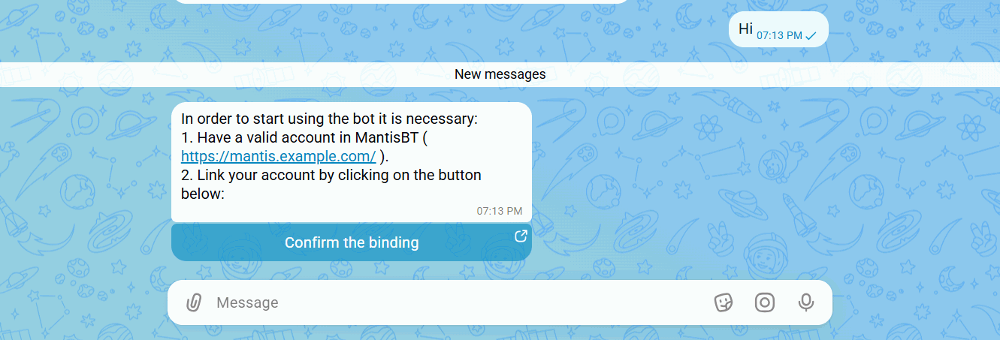
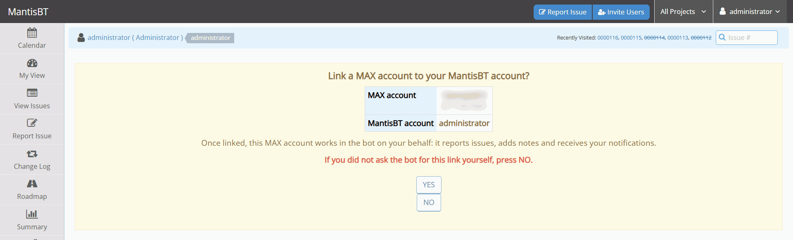
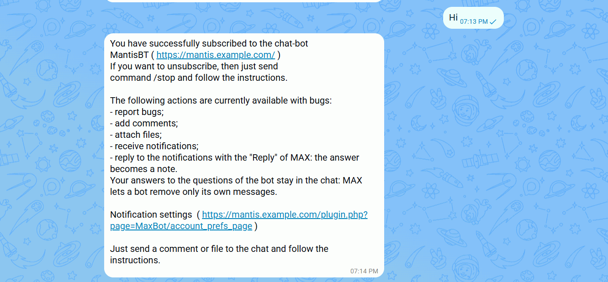
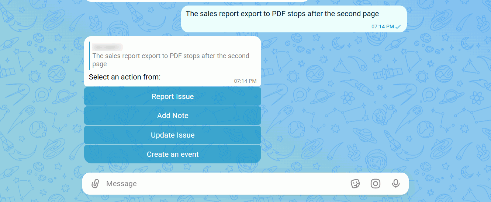
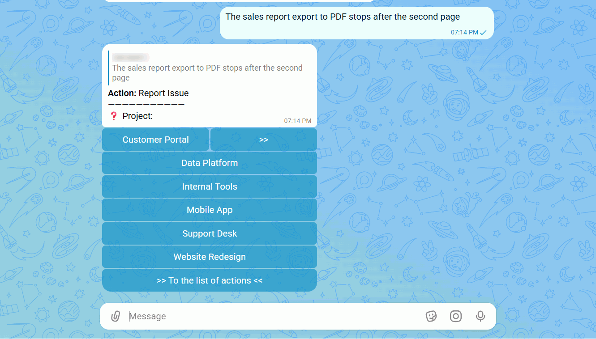
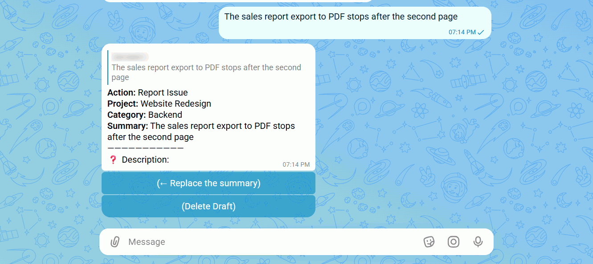
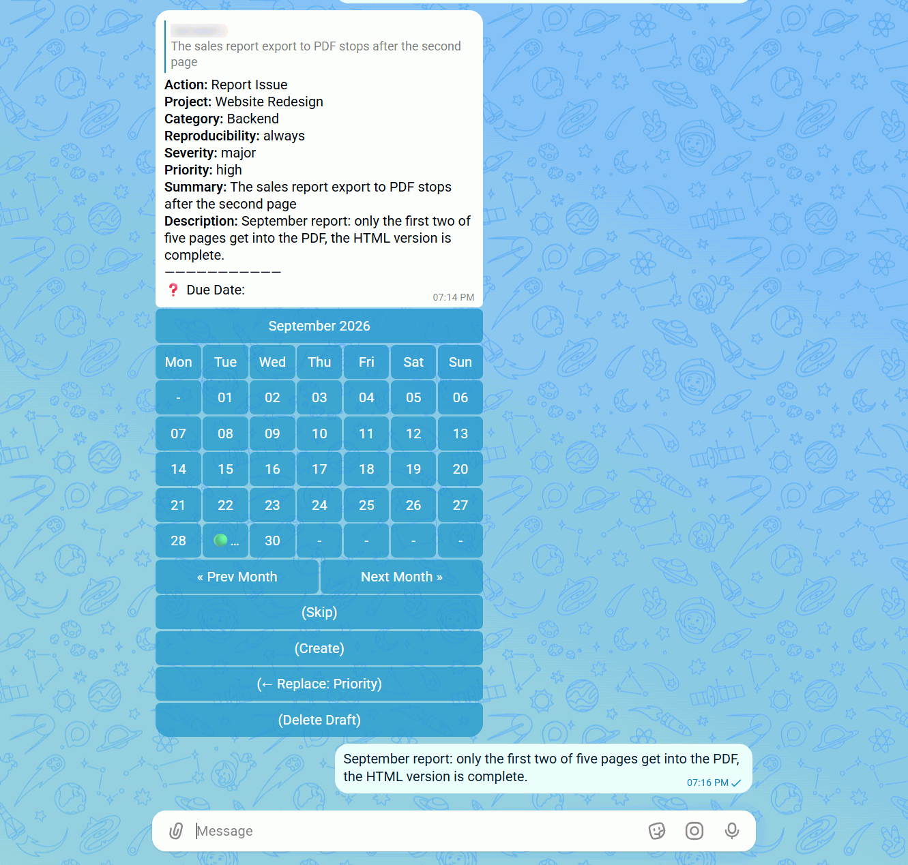
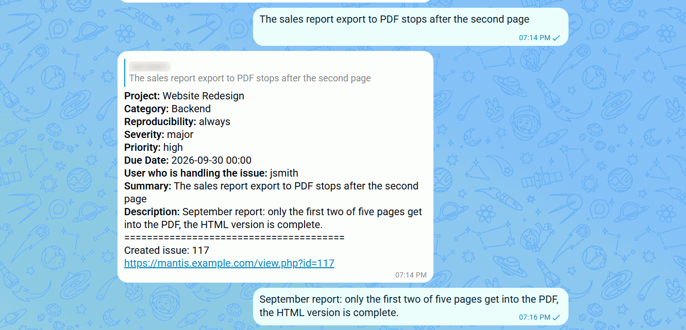
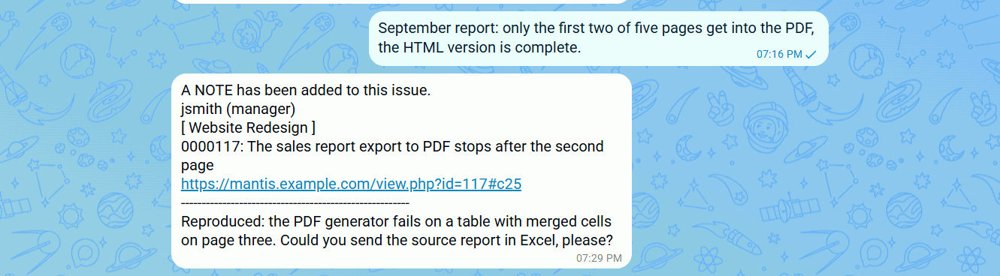
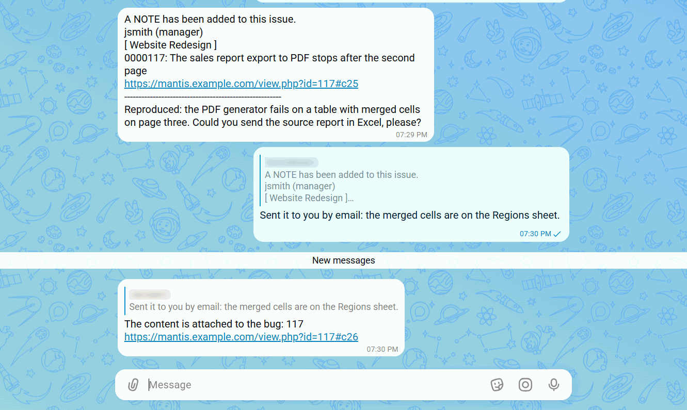

# MantisBT MaxBot Plugin

Overview
--------
This is a bot for the [MAX](https://max.ru) messenger.

It is the MAX counterpart of the [TelegramBot](https://github.com/mantisbt-plugins/TelegramBot) plugin:
the dialogs, the notifications and the settings are the same, and both plugins can be installed in
one MantisBT instance side by side.

A bot in MAX can be created only by a verified organization, sole proprietor or self-employed
resident of Russia on the [MAX for business](https://business.max.ru) platform. The token of the
bot is taken there.

Screenshots
-----------












Features
--------
- Report bugs;
- Attach files to bugs;
- Send comments to bugs;
- Receive notification when:
    - creating a bug;
    - change the status of the bug;
    - adding a comment to the bug;
    - mention of the user in the commentary.
- Respond to chat alerts about events using the built-in function "Reply". The answer will be added as a comment to the bug;
- Support SOCKS5 proxy server ( Requires curl >= 7.21.7 );
- Two ways of getting updates from MAX: webhook and long polling;
- Two ways of linking a MAX account to a MantisBT one: a confirmation link, or a PIN code shown in the chat and entered in MantisBT;
- Unlink a MAX account: with the `/stop` command in the chat, from the user's own account page, or by an administrator;
- Broadcast a message with attached files to the MAX chats of the members of chosen projects;
- Guided issue creation covering every field of the report form:
    - custom fields of all MantisBT types, including the ones defined by third party cfdef files;
    - the required fields are asked first, then the issue can be created right away or the optional fields filled in;
    - the monitors of the new issue, when `monitors` is listed in `$g_bug_report_page_fields`, the way the report page of MantisBT does it;
    - long lists of users (handler, monitors) are shown page by page;
    - inline navigation: go back to any answered step, skip any optional field;
    - an inline calendar for the date fields with the month, year and twelve year views;
    - required fields and value formats are validated right in the dialog.
- Update an issue from the chat: pick it by project and filter, then change its status the way the status change page of MantisBT does;
- Integration with the [Calendar](https://github.com/mantisbt-plugins/Calendar) plugin, version 3.0.0 or higher:
    - create calendar events from the chat;
    - notifications about the events created, changed and deleted, the members added and removed, and the replies to the invitations, optionally with the event file (.ics) attached;
    - reply to an invitation, choose the reminders and put off a reminder with the buttons under the notification.

The bot works in private chats only: messages and button presses coming from group chats and
channels are ignored, since the menus and the lists of issues are personal.

Download
--------
Please download the stable version.
(https://github.com/mantisbt-plugins/MaxBot/releases/latest)


How to install
--------------

1. Copy MaxBot folder into plugins folder.
2. Open Mantis with browser.
3. Log in as administrator.
4. Go to Manage -> Manage Plugins.
5. Find MaxBot in the list.
6. Click Install.
7. Click MaxBot link
8. Enter the token of the bot and follow the instructions.

Getting updates: Webhook or Script
----------------------------------

MAX delivers updates to a bot in one of two ways, chosen in the plugin settings
(*Manage -> Manage Plugins -> MaxBot -> Settings*, option **Getting updates method**).

**Webhook** - MAX servers connect to your MantisBT instance themselves, so it has to be reachable
from the Internet over HTTPS on port 443, with a certificate issued by a trusted CA (or by the
Russian Ministry of Digital Development) and the full chain. Self-signed certificates, plain HTTP
and other ports are refused by MAX. The address of the webhook is built from `$g_path`, and the
settings page warns when MAX would not accept it. Updates arrive instantly and nothing has to be
scheduled.

MantisBT has to answer an update within 30 seconds, and after 8 hours of failed deliveries MAX
drops the subscription. The webhook URL carries no credentials: on subscribing the plugin
generates a random secret, MAX sends it back in the `X-Max-Bot-Api-Secret` header of every update,
and a request without the right secret is refused.

**Script** (long polling) - MantisBT asks MAX for updates itself, over an outgoing HTTPS
connection only - no certificate of your own is involved. Use it when publishing MantisBT on the
Internet is not possible. Add the script shown on the settings page to your scheduler, for
example:

```
* * * * * /usr/bin/php <mantisbt>/plugins/MaxBot/scripts/get_updates.php >/dev/null 2>&1
```

A single run keeps a connection to MAX open and processes updates as soon as they arrive, so the
schedule above is not a polling interval - it only restarts the script for the next minute. Two
settings control the timing, both on the settings page in the Script mode:

- **Long polling timeout** (30 s by default, at most 90 s) - how long MAX holds the connection
  while there are no updates. It has to stay below the server response timeout, otherwise the
  connection is dropped before MAX answers.
- **Run time** (55 s by default) - how long a single run works before exiting. Keep it below the
  interval between runs; a run started while another one is still working exits immediately.
  Setting it to 0 makes the script poll once and exit.

Only one instance runs at a time - parallel requests of one bot would take the updates away from
each other. The page *Status of the bot* shows when the script was last started, which is the way
to tell that the scheduler entry actually works. Note that both methods are mutually exclusive:
while a webhook subscription exists, MAX gives out no updates to the script, so switching to
Script removes the subscription.

For the Script mode the URL of your MantisBT instance must be known: in CLI it cannot be derived
from the request, and the bot puts it into the links it sends. Set `$g_path` in `config_inc.php`,
or fill the URL field on the settings page if MantisBT is published under a different name for
external users.

**Connection debug mode** (settings page) writes the whole exchange with MAX, messages of the
users included, to the file given in **Path to log file**; the token of the bot is not written.
Only a `.log` or `.txt` file in an existing directory outside the web root is accepted, and a file
created by the plugin is readable by its owner only. Files received from MAX are downloaded to a
directory of their own inside the temporary directory of the system, readable by the web server
user only, and removed as soon as they are attached to the issue.

Linking accounts: Link or PIN code
----------------------------------

Before a MAX user can report anything, his chat has to be linked to a MantisBT account. How that
binding is confirmed is chosen in the plugin settings (*Manage -> Manage Plugins -> MaxBot ->
Settings*, section **Account linking settings**, option **How users link their accounts**).

**Link** - the bot sends a button leading to a MantisBT page, where the user, already logged in,
confirms the binding in one tap. This requires MantisBT to be reachable from the device MAX runs
on, usually a phone - which rules the method out for an instance published on the local network
only.

The link is good for one use within 15 minutes, and a new invitation cancels the previous one.
The confirmation page names the MAX account about to be linked and the MantisBT account it will
act for; answering **No** cancels the link. A link received from somebody else must never be
confirmed: the MAX account of its sender would then work in the bot on your behalf.

**PIN code** - the bot shows a 4-digit code in the chat, and the user enters it on the *MAX
binding* page of his MantisBT account (*My Account -> MAX binding*). Nothing has to be opened from
the phone, so this is the method for an instance that is not published to the Internet. The code
is valid for 15 minutes; sending any message to the bot issues a new one, and entering a code that
has just expired makes the bot send a fresh one to the chat by itself.

**Link and PIN code** - the invitation carries both, and the user takes whichever works for him.

Whichever method is chosen, a binding is never replaced silently: a chat already linked to
another MantisBT account is released by its owner with the `/stop` command, and a MantisBT account
already linked to a MAX account is unlinked on its *MAX settings* page before another one can be
linked. The previous invitation is deleted from the chat when a new one is sent, so only one stays
on screen; when the PIN code method is active, an invitation link sent earlier leads to a page
saying so instead of binding anything.

Entering wrong PIN codes is rate limited: after the configured number of wrong attempts within the
lockout window the page refuses further codes until the window ends. Both the limit and the window
are plugin settings; active lockouts are listed on the *Status of the bot* page, each with a reset
button.

Unlinking
---------

A binding is released in one of three ways:

- **From the chat** - the `/stop` command unsubscribes the chat from the notifications and
  releases the binding.
- **By the user** - the *My Account -> MAX settings* page shows the linked account with an
  **Unlink** button next to it. This is the way to go when the MAX account is lost or has changed
  hands, so the `/stop` command is out of reach; the chat is told it was unsubscribed.
- **By an administrator** - the *Status of the bot* page lists the linked users, each with an
  **Unlink** button. Whether the chat is told about the unlink is decided by a checkbox on the
  confirmation page - a lost account deserves the notice, a cleanup of stale bindings does not;
  the **Tell the user when an administrator unlinks his account** setting only chooses the state
  the checkbox starts in.

Deleting a MantisBT account releases its binding as well, silently: the account is gone, so there
is nothing to invite the chat back to. In every case the chat itself keeps working as an unlinked
one and offers to link an account on the next message.

Broadcast messages
------------------

A user can send a one-off message - text and files - from MantisBT to the MAX chats of all members
of the chosen projects at once. The feature is off by default and is configured on the *Broadcast*
tab of the plugin pages: users at or above the configured access level may broadcast to every
project, any other user - only to the projects explicitly granted to him there. Everybody allowed
to broadcast to at least one project gets the *Send message* entry in the MantisBT menu.

The recipients are the enabled members of the selected projects who have linked their MAX
accounts; the message opens with a header naming the sender, in the language of each recipient.

Calendar plugin integration
---------------------------

With the [Calendar](https://github.com/mantisbt-plugins/Calendar) plugin of version 3.0.0 or higher
installed, the plugin pages get the *Calendar plugin integration* tab. The integration is off by
default; once it is switched on there:

- the action list of the bot offers **Create an event** - a dialog asking for the project, the
  name, the description, the dates, the linked issues and the members, with the same inline
  calendar as the issue dialog. The access levels of Calendar apply as they do on its own pages;
- the bot notifies about the events the same way it does about issues, whether the event was
  changed from the chat or from the Calendar pages. Who is notified of what is set by a matrix on
  the same tab, globally or per project, and every user may switch each kind of notification off on
  his *My Account -> MAX settings* page;
- the event file (.ics) may go along with the notifications: never, for everybody unless a user
  switches it off, or only for those who switch it on;
- the reminders of Calendar are repeated in the chat, and the buttons under a notification answer
  the invitation, pick the reminders or put off the one just received.

An older Calendar is treated as absent: the tab and the **Create an event** action are not shown.

Supported Versions
------------------

- MantisBT 2.26 and higher, verified up to MantisBT 2.28.4;
- The plugin declares no PHP version of its own: the minimum is the one required by the MantisBT
  release it runs on - PHP 7.2.5 for MantisBT 2.26.x and PHP 7.4.0 for 2.27.0 and higher. Tested
  up to PHP 8.4;
- The Calendar plugin is optional; the integration with it requires Calendar 3.0.0 or higher;
- The TelegramBot plugin may be installed alongside, each bot works with its own messenger.


Donate
--------------
All work on this plugin consists of many hours of coding during our free time, to provide you with a MAX bot
that is easy to use. If you enjoy using this plugin and would like to say thank you, donations are a great
way to show your support.

Donations are invested back into the project 👍

Thank you for keeping this project alive 🙏

Available methods:
1. TGFFBC28Wo27aQ24L4ku6y3Egbe12Jhv1k (USDT TRC20)
2. 1PxyVPeYhRUtt5Mg1t3xSmFtHSYf2CabLR (BTC)
